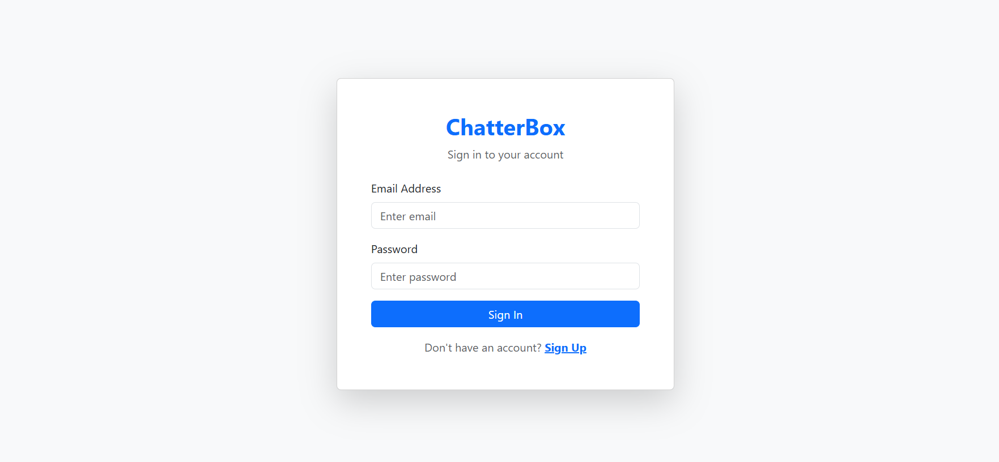
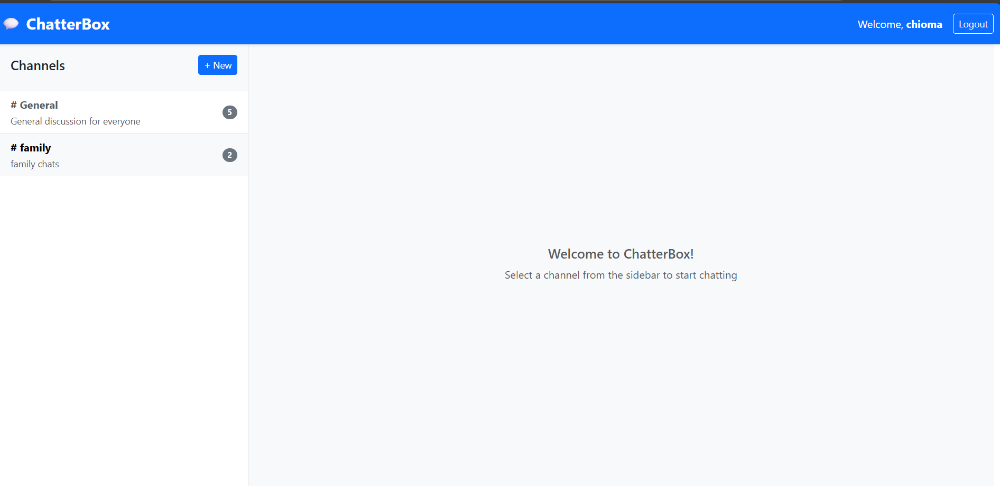
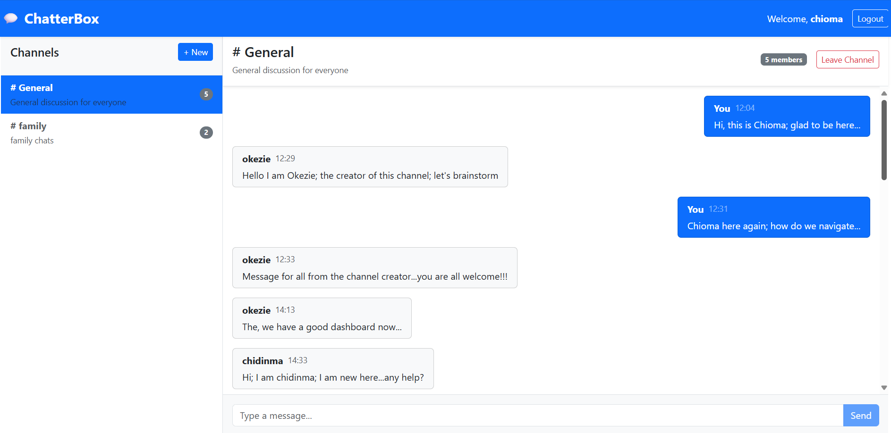

# ChatterBox

A modern, full-stack team communication platform built with the MERN stack. ChatterBox enables teams to collaborate through organized channels with real-time messaging capabilities.

---

## Features

### Core Functionality

- **User Authentication** - Secure registration and login using JWT tokens and bcrypt password hashing
- **Channel Management** - Create public channels with descriptions and manage memberships
- **Real-Time Messaging** - Send and receive messages with automatic refresh (3-second intervals)
- **Member Tracking** - View channel member counts and see who's in each channel
- **Responsive Design** - Clean, modern UI built with React Bootstrap

### Additional Features

- **Protected Routes** - Authorization middleware ensures secure access
- **Optimistic UI Updates** - Instant feedback on user actions
- **Auto-Refresh** - Messages update automatically without page reload
- **Channel Discovery** - Browse and join available public channels
- **Persistent Sessions** - JWT tokens stored in localStorage for seamless experience

---

## Tech Stack

### Backend

- **Runtime:** Node.js
- **Framework:** Express.js
- **Database:** MongoDB with Mongoose ODM
- **Authentication:** JSON Web Tokens (JWT)
- **Security:** bcryptjs for password hashing
- **Middleware:** express-async-handler, CORS

### Frontend

- **Library:** React 18
- **Build Tool:** Vite (modern, fast development)
- **UI Framework:** React Bootstrap 5
- **HTTP Client:** Axios with interceptors
- **Routing:** React Router v6
- **State Management:** Context API

### Development Tools

- **Process Management:** Concurrently (run backend & frontend simultaneously)
- **Auto-Reload:** Nodemon for backend development
- **Module System:** ES6+ with CommonJS in backend

---

## Project Structure

```
chatterbox/
├── backend/                        # Server-side application
│   ├── database/
│   │   ├── databaseInit.js        # MongoDB connection setup
│   │   └── repositories/          # Data access layer
│   │       ├── userRepository.js
│   │       ├── channelRepository.js
│   │       └── messageRepository.js
│   ├── middleware/
│   │   ├── authenticationHandler.js  # JWT verification
│   │   └── errorHandler.js           # Centralized error handling
│   ├── models/                    # Mongoose schemas
│   │   ├── userModel.js
│   │   ├── channelModel.js
│   │   └── messageModel.js
│   ├── services/                  # Business logic layer
│   │   ├── userService.js
│   │   ├── channelService.js
│   │   └── messageService.js
│   ├── routes/                    # API endpoints
│   │   ├── authRoutes.js
│   │   ├── channelRoutes.js
│   │   └── messageRoutes.js
│   ├── constants.js               # Configuration constants
│   └── server.js                  # Application entry point
│
├── frontend/                      # Client-side application
│   ├── src/
│   │   ├── components/
│   │   │   ├── Auth/              # Login & Register components
│   │   │   ├── Channels/          # Channel list & creation
│   │   │   ├── Chat/              # Messaging components
│   │   │   └── Layout/            # Navbar & Protected routes
│   │   ├── context/
│   │   │   └── AuthContext.jsx   # Global authentication state
│   │   ├── pages/
│   │   │   ├── LoginPage.jsx
│   │   │   ├── RegisterPage.jsx
│   │   │   └── DashboardPage.jsx
│   │   ├── services/              # API integration layer
│   │   │   ├── api.js             # Axios instance with interceptors
│   │   │   ├── authService.js
│   │   │   ├── channelService.js
│   │   │   └── messageService.js
│   │   ├── constants.js           # Frontend configuration
│   │   ├── App.jsx                # Root component with routing
│   │   └── main.jsx               # Application entry point
│   └── package.json
│
├── package.json                   # Root scripts (concurrently)
└── README.md
```

### Architecture Pattern

The backend follows a **layered architecture**:

```
Routes → Services → Repositories → Models → Database
```

This separation ensures:

- **Maintainability** - Clear separation of concerns
- **Testability** - Each layer can be tested independently
- **Scalability** - Easy to add new features without affecting existing code

---

## Getting Started

### Prerequisites

- **Node.js** (v16 or higher)
- **MongoDB** (running locally or MongoDB Atlas account)
- **npm** or **yarn**

### Installation

1. **Clone the repository**

```bash
   git clone <repository-url>
   cd chatterbox
```

2. **Install all dependencies**

```bash
   # Install root dependencies (this drives the backend also)
   npm install

   # Install frontend dependencies
   cd frontend
   npm install

   # Return to root
   cd ..
```

### Configuration

#### Backend Configuration

Edit `backend/constants.js`:

```javascript
module.exports = {
  DATABASE_URI: "mongodb://localhost:27017/ChatterBox",
  SERVER_PORT: 8080,
  JWT_SECRET_KEY: "your-secret-key-here",
};
```

**Or** create `backend/.env` (optional):

```env
DATABASE_URI=mongodb://localhost:27017/chatterbox
SERVER_PORT=8080
JWT_SECRET_KEY=your-secret-key-here
```

#### Frontend Configuration

Edit `frontend/src/constants.js`:

```javascript
const API_URL = "http://localhost:8080/api";
export default API_URL;
```

### Running the Application

#### Option 1: Run Both Servers Simultaneously (Recommended)

# at the root:

npm run dev

This starts:

- Backend API server on `http://localhost:8080`
- Frontend dev server on `http://localhost:5173`

#### Option 2: Run Servers Separately

```bash
# Terminal 1 - Backend
cd backend
npm run server

# Terminal 2 - Frontend
cd frontend
npm run dev
```

### Access the Application

Open your browser and navigate to:

```
http://localhost:5173
```

---

## 📡 API Endpoints

### Authentication Routes (`/api/auth`)

| Method | Endpoint    | Description       | Auth Required |
| ------ | ----------- | ----------------- | ------------- |
| POST   | `/register` | Register new user | No            |
| POST   | `/login`    | Login user        | No            |
| GET    | `/profile`  | Get user profile  | Yes           |

### Channel Routes (`/api/channels`)

| Method | Endpoint     | Description                   | Auth Required |
| ------ | ------------ | ----------------------------- | ------------- |
| GET    | `/`          | Get all channels              | No            |
| POST   | `/`          | Create new channel            | Yes           |
| GET    | `/:id`       | Get channel by ID             | No            |
| POST   | `/:id/join`  | Join a channel                | Yes           |
| POST   | `/:id/leave` | Leave a channel               | Yes           |
| DELETE | `/:id`       | Delete channel (creator only) | Yes           |

### Message Routes (`/api/channels`)

| Method | Endpoint        | Description                 | Auth Required |
| ------ | --------------- | --------------------------- | ------------- |
| GET    | `/:id/messages` | Get all messages in channel | Yes           |
| POST   | `/:id/messages` | Send message to channel     | Yes           |

---

## Testing the Application

### Manual Testing Flow

1. **Register a User**

   - Navigate to registration page
   - Create account with username, email, and password
   - Automatically redirected to dashboard

2. **Create a Channel**

   - Click "+ New" button in sidebar
   - Enter channel name and description
   - Channel appears in list

3. **Send Messages**

   - Click on a channel
   - Type message and press "Send"
   - Message appears in chat window

4. **Multi-User Testing**
   - Open incognito/private browser window
   - Register second user
   - Join existing channel
   - Test real-time message synchronization

### Sample Test Credentials

For demonstration purposes, you can create test accounts:

```
User 1: okezie@test.com / password123
User 2: chioma@test.com / password123
```

---

## Key Technical Highlights

### Backend Achievements

- **Repository Pattern** - Clean data access abstraction
- **Service Layer** - Business logic separation from routes
- **Error Handling** - Centralized error middleware with custom messages
- **Security** - JWT tokens, bcrypt hashing, protected routes
- **Validation** - Mongoose schema validation + service-level checks
- **Population** - Efficient data relationships with Mongoose populate

### Frontend Achievements

- **Context API** - Global authentication state without Redux
- **Optimistic UI** - Instant feedback on user actions
- **Silent Refresh** - Background message updates without UI flicker
- **Protected Routes** - Client-side route guards
- **Axios Interceptors** - Automatic token injection and error handling
- **Responsive Design** - Mobile-friendly Bootstrap layout

### Development Workflow

- **Monorepo Structure** - Backend and frontend in single repository
- **Concurrently** - Single command to run both servers
- **Modern Tooling** - Vite for fast development builds
- **Hot Reload** - Nodemon (backend) + Vite HMR (frontend)

---

## Security Features

- **Password Hashing** - bcrypt with salt rounds for secure storage
- **JWT Tokens** - Stateless authentication with 7-day expiry
- **Protected Routes** - Server-side middleware verification
- **CORS Configuration** - Controlled cross-origin requests
- **Input Validation** - Mongoose schemas + manual validation
- **Error Sanitization** - No sensitive data leaked in error messages

---

## Known Limitations & Future Enhancements

### Current Limitations

- Messages refresh every 3 seconds (not true real-time)
- No file upload support
- No direct messaging between users
- No message edit/delete functionality
- No user profile customization

### Potential Future Enhancements

- **WebSockets** - True real-time messaging with Socket.io
- **File Sharing** - Image and document uploads
- **Direct Messages** - One-on-one conversations
- **Notifications** - Browser notifications for new messages
- **Search** - Message and channel search functionality
- **Reactions** - Emoji reactions to messages
- **Typing Indicators** - Show when users are typing
- **User Presence** - Online/offline status

---

## Project Compliance

This project fulfills all requirements of the capstone project:

### Required Features

- [x] User Authentication (JWT + bcrypt)
- [x] Create channels
- [x] Join channels
- [x] Send messages
- [x] View messages per channel
- [x] Protected routes
- [x] MongoDB database
- [x] Express backend
- [x] React frontend

### Bonus Features

- [x] Leave channel functionality
- [x] Delete channel (creator-only authorization) - available in backend (use POSTMAN to test)
- [x] Auto-refresh messages
- [x] Member count display
- [x] Channel descriptions

---

## Author

**Okezie Chinedum ORIAKU**

Capstone Project - Full-Stack Web Development Course

_This project demonstrates proficiency in:_

- Full-stack JavaScript development
- RESTful API design
- Database modeling with MongoDB
- Modern React development
- Authentication & authorization
- State management
- Responsive UI design

---

## License

This project was created for educational purposes as part of a capstone project.

---

## Acknowledgments

- Course instructors and teaching assistants
- MongoDB documentation
- React and Express.js communities
- Stack Overflow community
- Youtube tutorials
- Course materials provided by Great Learning

---

**Built with ❤️ and lots of ☕**

## 📸 Screenshots

### Login Page



### Dashboard



### Chat Interface


